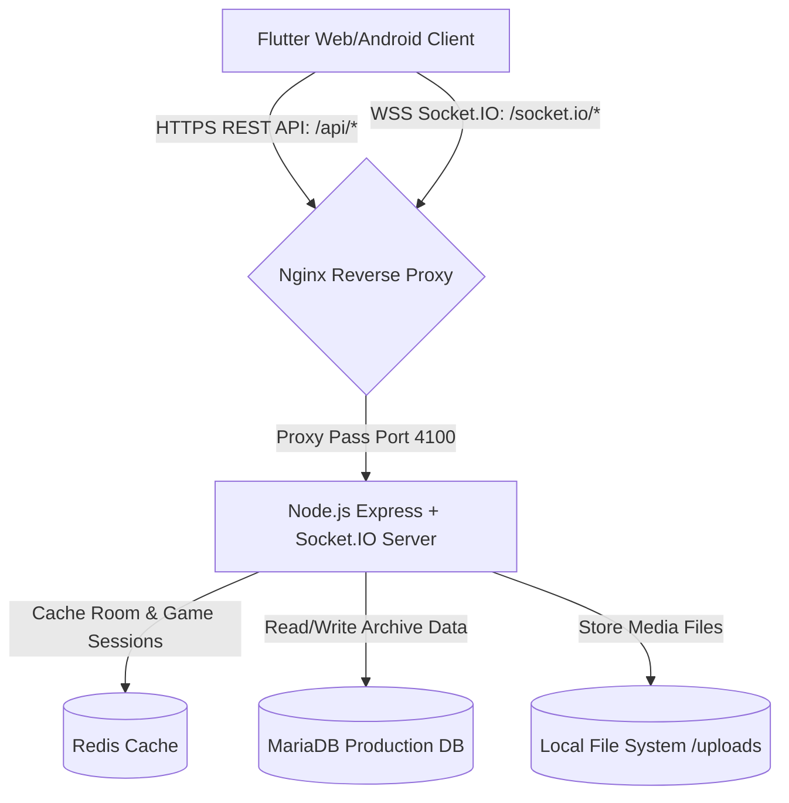

# 01. [기획] 비밀기지(Secret Base) 프로젝트 정의 및 기획 명세서

> [!NOTE]
> 본 문서는 커플만을 위한 프라이빗 실시간 게임 및 일상 아카이빙 플랫폼 비밀기지(Secret Base)의 기획 단계 내용을 상세히 정리한 것이다. 노션(Notion)에 페이지 단위로 복사하거나 마크다운 가져오기(Import)를 통해 즉시 구조화된 페이지로 사용할 수 있도록 포맷팅되어 있다.

---

## 1. 프로젝트 개요 (Overview)

### 1.1 기획 의도 및 배경
* **SNS 피로감 해소**: 불특정 다수에게 보여주기 위한 인스타그램, 페이스북 등의 오픈 SNS와 달리, 오직 연인 두 사람만 공유하는 닫힌 공간을 지향한다.
* **친밀도 극대화**: 실시간 미니게임으로 일상 속 가벼운 재미를 선사하고, 아카이빙 기능을 통해 둘만의 추억을 소중하게 보관한다.
* **일상의 습관화**: 단순 유틸리티의 모음이 아니라, 매일 들어와서 서로의 상태를 확인하고 기록하는 '커플만의 일일 리추얼(Ritual)'을 형성하도록 돕는다.

### 1.2 서비스 핵심 목표
1. **완벽한 프라이빗**: 2인 전용 매핑 구조 및 방 시스템 설계로 타인의 접근 원천 차단.
2. **실시간 연결감**: Socket.IO 기반의 실시간 Presence 및 물리 동기화 게임 제공.
3. **지속 가능한 아카이빙**: 감정 소모가 적은 간단한 기록(MomentLoop)과 유의미한 회고(Q&A, 챌린지) 연동.

---

## 2. 제품 스펙 및 기능 명세 (Feature Spec)

### 2.1 아케이드 존 (Arcade Zone)
실시간 2인 동기화 기반 게임으로, 술자리나 일상에서 실시간으로 대결하거나 즐길 수 있는 8종의 미니게임으로 구성되어 있다.

| 게임명 | 핵심 규칙 및 사양 | 동기화 방식 |
| :--- | :--- | :--- |
| **주사위** | 1~6의 무작위 숫자를 굴려 상대방과 값을 동기화 및 비교 | Client-Triggered Event |
| **룰렛** | 커스텀 벌칙 항목들을 설정한 뒤 회전시켜 당첨 항목 판정 | Client-Triggered Event |
| **가위바위보** | 양방향 동시 선택 완료 시점에 상태를 열어 승패 판정 | Server-Mediated State |
| **텔레파시** | 두 가지 선택지 중 동시 선택을 진행하여 일치 여부 확인 | Server-Mediated State |
| **해적 룰렛** | 슬롯을 번갈아 찌르며 당첨 슬롯(폭탄)에 걸린 사람 판정 | Server-Driven Turn |
| **윷놀이 (Yut)** | 4개 윷가락 물리 결과, 말 이동 및 잡기, 지름길, 윷/모 보너스 턴 제공 | Yut State Machine |
| **UNO 카드** | 108장 덱 셔플, 특수카드(Skip, Reverse, Draw2/4), Discard All 카드 규칙 | UNO Game Engine |
| **폭탄 돌리기** | 타이머(10-120초) 내 퀴즈 정답 시 상대에게 전달, 타임아웃 폭발 | Bomb Timer Engine |

#### 윷놀이 세부 규칙
* **턴제 관리**: 선공 결정 단계를 거쳐 서버가 턴을 제어한다.
* **보너스 턴**: 윷 또는 모가 나오면 추가 던지기 기회를 제공한다.
* **백도 및 낙**: 백도 발생 시 뒤로 갈 말이 없으면 무효(nak) 처리 등의 상세 판정이 서버 주도로 수행된다.
* **업기 및 잡기**: 아군 말을 업어서 이동시키거나 상대방 말을 잡을 시 보너스 턴을 획득한다.

#### UNO 세부 규칙 (클래식 vs 고와일드)
* **Classic Mode**: 정통 우노 룰로 진행하며, 특수 카드 중 discard_all을 제외하여 밸런스 있는 플레이를 유도한다.
* **Go Wild Mode**: 폭발적인 룰로, 누적 공격(+2, +4 챌린지 및 누적 방어)이 가능하며, 특정 색상 카드를 한번에 털어내는 discard_all 카드를 지원한다.
* **선물 리액션**: 게임 중 케이크, 커피, 피자, 토마토 등의 감정 리액션을 보내어 화면 상에 버스트 애니메이션과 사운드를 동기화한다.

### 2.2 아카이브 존 (Archive Zone)
둘만의 영구적인 역사를 기록하는 영역으로 데이터베이스(MariaDB)와 REST API로 연동된다.

1. **MomentLoop (모먼트루프 - 기존 셋로그 개선)**
   * 매시간 찾아오는 기록의 피로감을 줄이기 위해 하루 3~5회 또는 직접 기록 모드를 제공한다.
   * 2~4초 분량의 날것의 숏폼 영상 또는 즉석 사진 촬영 후 캡션과 해시태그 기록을 남긴다.
   * 하루가 끝나면 둘의 타임라인을 시간순으로 이어 붙인 '오늘의 루프'가 생성된다.
2. **비밀 지도 (Secret Map)**
   * 커플의 데이트 장소를 핀(Pin) 형태로 저장한다.
   * 카테고리 분류(식당, 카페, 활동, 여행, 쇼핑, 기타)와 함께 방문 날짜, 별점(1-5), 동행 메모를 기록한다.
3. **10시의 Q&A (Daily Q&A)**
   * 매일 밤 10시, 새로운 커플 질문이 등록된다 (기본 30개 이상의 한국어 전용 질문 풀 보유).
   * **핵심 규칙**: 상대방의 답변은 내가 답변을 완료하기 전까지 마스킹(가려짐) 처리되어 상호 정직하고 궁금증을 유발하는 UX를 유지한다.
4. **목표 챌린지 (Challenges)**
   * 커플 공동의 목표(예: "데이트 비용 50만원 아끼기", "이번 달 운동 10회")를 설정한다.
   * 진행도(LinearProgressIndicator)가 시각화되며 목표량 달성 시 완료 뱃지가 부여된다.
5. **프라이빗 주크박스 (Jukebox)**
   * 커플이 함께 듣고 싶은 MP3, WAV 등의 음원을 서버 로컬(/uploads)에 업로드하여 플레이리스트를 공유한다.
6. **타임 캡슐 (Time Capsules)**
   * 미래의 특정 날짜를 지정하여 편지, 사진, 음성 메시지를 봉인한다. 해당 일자가 도래하기 전까지는 개봉할 수 없다.

### 2.3 리텐션 강화 설계 (Anniversary & Loop)
* **D-Day 및 디바이스 알림**: 홈 화면에서 연애 시작일 기준 기념일을 카운팅하고, 상대방이 액션(답변 완료 등)을 하거나 스트릭이 만료되기 직전에 알림을 발송한다.
* **커플 스트릭(Streak)**: 개인이 아닌 커플 단위로 하루 1개 이상의 아카이브 미션 완료 시 스트릭 카운트가 유지되도록 기획하여 상호 참여를 독려한다.

---

## 3. 시스템 아키텍처 (Architecture)



* **인프라 구성**:
  * **프론트엔드**: Flutter Web 빌드본을 /var/www/secretbase 경로에 정적 배치하고 Nginx로 호스팅.
  * **백엔드**: Node.js Express 및 Socket.IO 서버를 PM2 프로세스 관리자로 데몬 실행(Port 4100).
  * **보안**: Let's Encrypt SSL 인증서를 Nginx에 탑재하여 HTTPS/WSS 프로토콜 강제화.

---

## 4. 데이터베이스 ERD 및 스키마 설계

영구 보관이 필요한 커플의 아카이브 데이터는 MariaDB(개발서버 기준)에 저장되며, 테이블 구조는 아래와 같다.

```sql
-- 1. 사용자 및 커플 정보 테이블
CREATE TABLE IF NOT EXISTS Users (
    id INT AUTO_INCREMENT PRIMARY KEY,
    user_code VARCHAR(10) UNIQUE NOT NULL,
    name VARCHAR(50) NOT NULL,
    created_at TIMESTAMP DEFAULT CURRENT_TIMESTAMP
);

CREATE TABLE IF NOT EXISTS Couples (
    id INT AUTO_INCREMENT PRIMARY KEY,
    room_code VARCHAR(50) UNIQUE NOT NULL,
    room_secret VARCHAR(100) NOT NULL,
    user1_id INT NOT NULL,
    user2_id INT NOT NULL,
    start_date DATE NULL,
    created_at TIMESTAMP DEFAULT CURRENT_TIMESTAMP,
    FOREIGN KEY (user1_id) REFERENCES Users(id),
    FOREIGN KEY (user2_id) REFERENCES Users(id)
);

-- 2. 아카이브: MomentLoop (셋로그)
CREATE TABLE IF NOT EXISTS setlog_posts (
    id INT AUTO_INCREMENT PRIMARY KEY,
    couple_id INT NOT NULL,
    user_id INT NOT NULL,
    media_type VARCHAR(10) NOT NULL, -- 'text', 'image', 'video'
    media_url VARCHAR(255) NULL,
    caption TEXT NULL,
    tags JSON NULL,
    captured_at TIMESTAMP DEFAULT CURRENT_TIMESTAMP,
    FOREIGN KEY (couple_id) REFERENCES Couples(id)
);

-- 3. 아카이브: 비밀 지도 핀
CREATE TABLE IF NOT EXISTS map_pins (
    id INT AUTO_INCREMENT PRIMARY KEY,
    couple_id INT NOT NULL,
    place_name VARCHAR(100) NOT NULL,
    category VARCHAR(20) NOT NULL, -- '식당', '카페', '활동', '여행', '쇼핑', '기타'
    rating INT DEFAULT 5,
    visit_date DATE NOT NULL,
    memo TEXT NULL,
    latitude DOUBLE DEFAULT 0,
    longitude DOUBLE DEFAULT 0,
    created_at TIMESTAMP DEFAULT CURRENT_TIMESTAMP,
    FOREIGN KEY (couple_id) REFERENCES Couples(id)
);

-- 4. 아카이브: 오늘의 Q&A
CREATE TABLE IF NOT EXISTS daily_questions (
    id INT AUTO_INCREMENT PRIMARY KEY,
    question TEXT NOT NULL,
    date DATE UNIQUE NOT NULL
);

CREATE TABLE IF NOT EXISTS question_answers (
    id INT AUTO_INCREMENT PRIMARY KEY,
    question_id INT NOT NULL,
    user_id INT NOT NULL,
    answer TEXT NOT NULL,
    created_at TIMESTAMP DEFAULT CURRENT_TIMESTAMP,
    FOREIGN KEY (question_id) REFERENCES daily_questions(id),
    FOREIGN KEY (user_id) REFERENCES Users(id),
    UNIQUE KEY uq_qa (question_id, user_id)
);

-- 5. 아카이브: 목표 챌린지
CREATE TABLE IF NOT EXISTS challenges (
    id INT AUTO_INCREMENT PRIMARY KEY,
    couple_id INT NOT NULL,
    title VARCHAR(100) NOT NULL,
    description TEXT NULL,
    target_value INT NOT NULL,
    current_value INT DEFAULT 0,
    unit VARCHAR(20) NOT NULL, -- '원', '회', '개' 등
    status VARCHAR(20) DEFAULT 'ACTIVE', -- 'ACTIVE', 'COMPLETED'
    owner_id INT NOT NULL,
    created_at TIMESTAMP DEFAULT CURRENT_TIMESTAMP,
    FOREIGN KEY (couple_id) REFERENCES Couples(id)
);

CREATE TABLE IF NOT EXISTS challenge_logs (
    id INT AUTO_INCREMENT PRIMARY KEY,
    challenge_id INT NOT NULL,
    value INT NOT NULL,
    note VARCHAR(255) NULL,
    created_at TIMESTAMP DEFAULT CURRENT_TIMESTAMP,
    FOREIGN KEY (challenge_id) REFERENCES challenges(id) ON DELETE CASCADE
);

-- 6. 아카이브: 주크박스 음악 파일
CREATE TABLE IF NOT EXISTS jukebox_tracks (
    id INT AUTO_INCREMENT PRIMARY KEY,
    couple_id INT NOT NULL,
    title VARCHAR(100) NOT NULL,
    artist VARCHAR(50) DEFAULT 'Unknown',
    file_url VARCHAR(255) NOT NULL,
    duration_sec INT DEFAULT 0,
    uploaded_by INT NOT NULL,
    created_at TIMESTAMP DEFAULT CURRENT_TIMESTAMP,
    FOREIGN KEY (couple_id) REFERENCES Couples(id)
);
```
